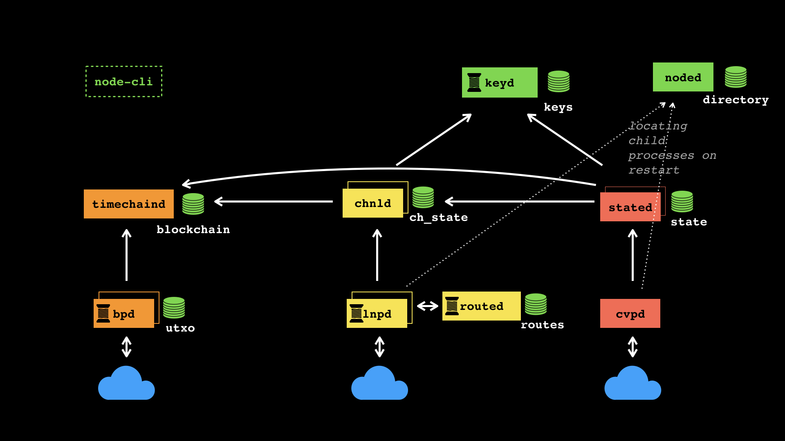

# LNP/BP protocol daemons suite

A set of daemons to run LNP/BP protocol, including Bitcoin, Lightning and Client-side validated state protocols.

Bitcoin protocol (BP):
* `bpd`: Bitcoin peer protocol daemon
* `timechaind`: Bitcoin timechain validation daemon (for now, to maintain the consensus compatibility, it will be a wrapper 
around Bitcoin Core w/o wallet but with ZMQ)

Lightning Network Protocol (LNP):
* `lnpd`: Lightning Network protocol peer communication daemon
* `channeld`: Lightning Network channel daemon
* `routed`: Lightning Network routing daemon

Client-side validation protocol (CVP):
* `cvpd`: Client-side validation protocol daemon
* `stated`: Client-side state daemon

Common tools:
* `keyd`: Cryptographic key & wallet management daemon
* `noded`: Directory service daemon
* `cli`: Command-line utilities for all of the daemons

